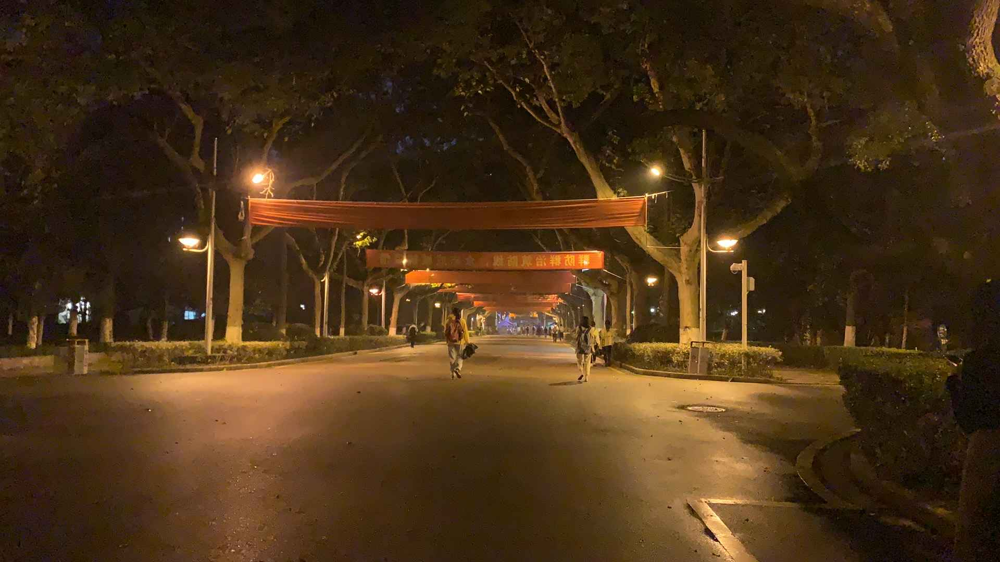
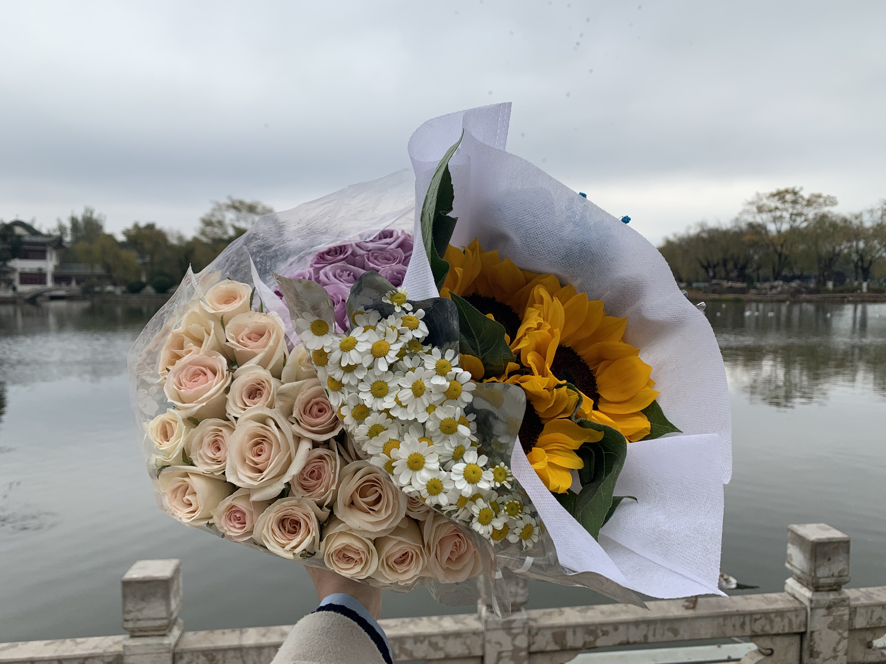

# Daily Life

 ## 上学日常

秋风乍起，像是生了气，忽然将半个秋的明媚没收。

总会在失去后怀念，幸好用心记录，认真过活每一天。

每一天都不同，每一天的喜怒哀乐，仿佛一生大抵如此。
搜集一点一滴的温热和感动，倔强地抵抗慢慢偷袭灵魂的虚伪和麻木。

“树叶在流浪，风还没静止”

恰巧听到一句很符合今天的歌词。

你会不会一天只听一首歌？

也许是会的吧

每天走一样的路，听一样的歌，这或许就是我的生活

## 课题调研
和课题组去云南昆明调研

短短两天的时间 就要匆匆和这个城市说再见

喜欢和陌生人说些没什么意义的话

这里的星星,细细碎碎的,亮得跟石榴籽似的

把时间融化在平常愉快里,这样可太好了

这里四季如春，到处都是鲜花

## 课程日常

这学期选了十一门课

零零碎碎的pre和作业把生活填的满满当当

虽然会抱怨这些繁杂的事情和看不懂的论文

但还是很喜欢这种充实的生活

