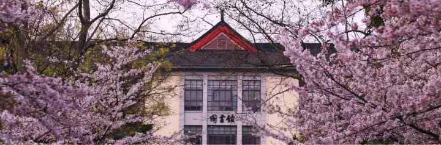
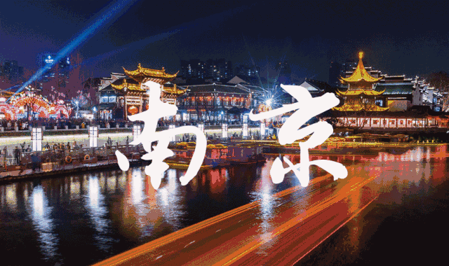

# My new home--Nanjing

那是一个依壁雕凿的城市！

你对南京的第一印象是什么？

是连绵的阴雨天气？

是房价超高令人不敢直视？

还是梧桐围城，遍地潘西？

## This is Nnajing

##### #1: 南京

在南京生活确实能让人感到“人杰地灵”氛围

以及长江中下游平原水土对食材特殊的滋润

南京还有许多美食，许多故事，都等待我们去寻

本人觉得唯一的不足是气候，夏天火炉般炙烤

冬季湿冷的魔法攻击，春秋两季超短

一秒入冬/夏是常有的事

##### #2: 南京人

常年生活在南京的人

敏感的能嗅出南京冬去春来的味道

早霜晚露的气息

老南京人会在夏天在树荫下乘着凉风习习

手中棋子落下又抬起

有些刺啦啦的南京话伴随着笑声此起彼伏

有时候没事在秦淮边散着步

看着水中渐渐多起的灯光

烁烁闪闪却奇异的抚平了心中的思绪

几年间高楼拔起

却无法掩盖穿梭在旧楼间令人怀念的吆喝声

光怪陆离的商厦

也不会改变南京大街小巷的小商铺

在南京人心中的特殊地位

南京将自己的怀旧藏在老城街老城墙中

藏在鸡鸣寺的钟声中，藏在秦淮河的波浪中

藏在栖霞寺的枫叶中，藏在紫金山的萤火虫中......

时光可以改变金陵身，却无法磨去金陵魂

##### #3: 南京景

玄武湖夜里栈道人来人往

满是恋爱酸臭的南林樱花大道

光影流年下的河西大道

大雨后平行世界里的奥体

人来人往的南图蕴藏着多少知识典籍

石狮子安静的蹲在老城南倾听城市的喧嚣

温暖灯光下的宁海路恬静优雅

紫金山上繁星点点的夜空

明孝陵埋葬了帝王将相的多少传奇叱咤

绚丽的赛虹桥立交对立热闹的新街口

这一切一切就是南京元素

它们组成了一个包容一切的南京城

不愠不怒

守候每一个在这儿打拼奋斗，生活安息的人

这是南京啊！

## 南京大学

#####  # 1: 南京大学的历史

南京大学在民国时期又称为国立中央大学，而国立中央大学的血脉最早甚至可以追溯到三国时期的南京太学。

这所学校真正的现代形态则是1902年成立的三江师范学堂，由张之洞和两江总督刘坤一支持创建的。

1905年更名为两江师范大学,以"嚼得菜根，做得大事”为校训,大力提倡科学、国学和艺术教育。

1914年改设成为南京高等师范大学，第二年设计我国第一个体育科。

1920年在南京高等师范大学的基础上组建国立东南大学，两所大学同处一个校区合并为国立东南大学。

1927年以国立东南大学为基础合并九所公学,成立国立第四中山大学。

1928年2月 又改名为国立江苏大学,遭到师生们的反对，1928年年5月改为国立中央大学。

到1949年更名为国立南京大学,第二年改为南京大学。

此时的南大还是最高光的时刻，全亚洲第一的。

##### # 2: 南京大学的日常

一个校园里都是法国梧桐、下小雨大太阳都不需要打伞的大学。

一个一步一景，四季皆美的大学

一个离南京市中心新街口最近，步行只要15分钟的大学。

一个去南京站、南京南站都很方便的大学。

一个称为“汉口路小学附属大学”的大学。

一个横穿北园南园一定是车让人的大学。

一个古老的北大楼经常上宣传页面的大学。

一个大礼堂有的是用当时被拆的明城墙砖盖的大学。

一个图书馆很破很破座位又少根本不想去的大学。

一个食堂经常遇见“能不能我把钱给你你帮我刷卡”的大学。

一个食堂会看见博士夫妻带着孩子打饭秀恩爱的大学。

一个唯一的教学楼被一个土豪校友捐了1000万就给冠名的大学。

一个北园都是各种人名（蒙民伟、费彝民、田家炳等等）冠名名大楼的大学。

一个北园四处有些可爱的小别墅如赛珍珠故居、何应钦公馆的大学。

一个傍晚会有老爷爷老年奶搀扶着散步在校园里的大学。

一个宿舍条件有点差没有阳台没有独卫还好有空调的大学。

一个有着侧门小粉桥门只允许一人通过的大学。

一个每次路过南北园之间都有人在照相的大学。

一个每到秋天就是桂花飘香落叶满地金光灿灿，到处是老爷爷老奶奶捡银杏果的公园的大学。

一个雨天去晚上洗澡还要打个伞横穿半个校园的大学。

##### # 3: 我的南大

这里既有喧嚣，也有宁静，刚柔并济，沉稳包容

坐落六朝古都，有丰富的历史文化遗产

且不似北京现代化的洪流淹没了历史文化

而逐渐使文化遗产渐渐沦为快餐式消费品

这里的文化遗产大多是生活中触手可及的

小小一方龙蟠虎踞，众多湖泊点缀其中，更添一番秀美

这里的生活忙碌且充实

这里的日子平淡却不乏味