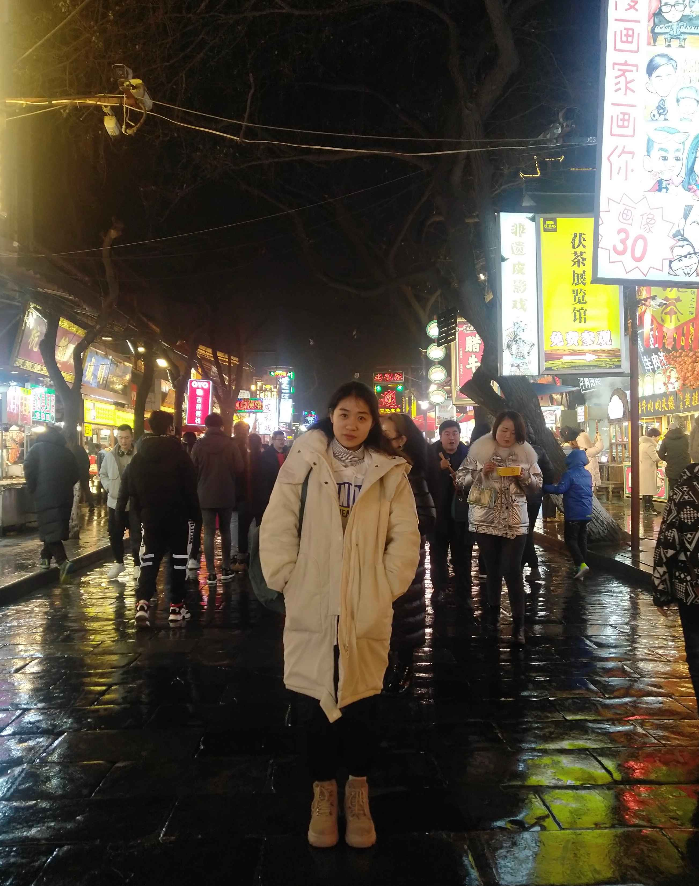
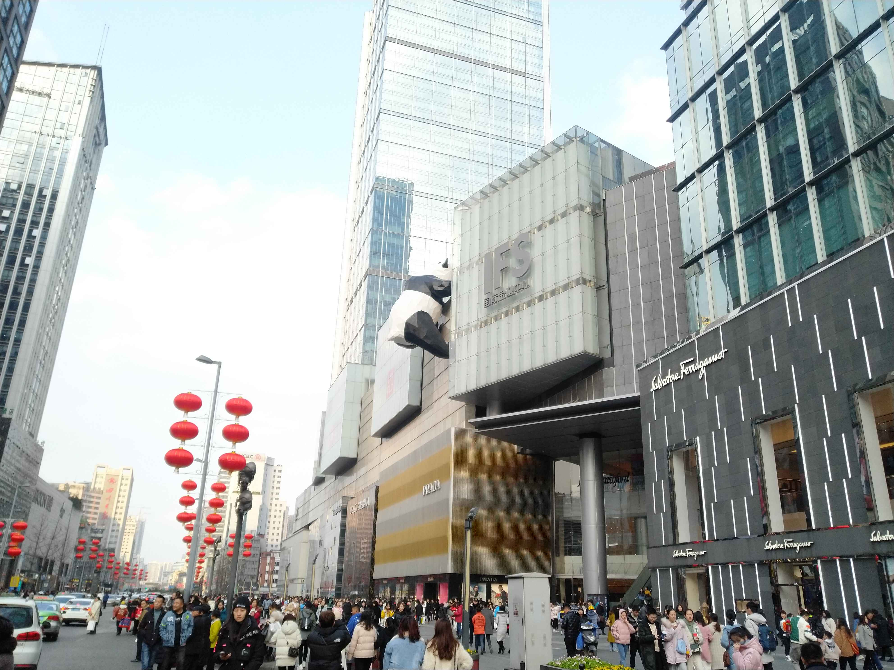
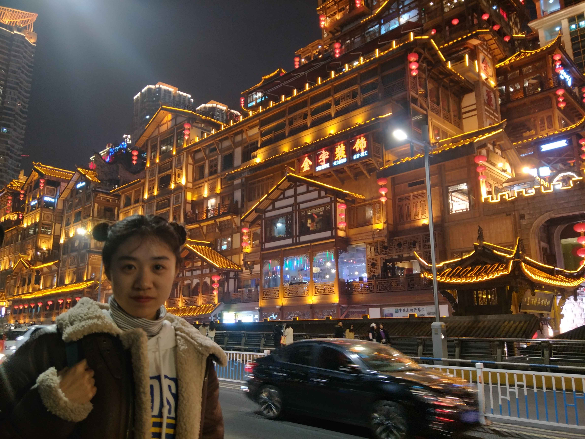

# Travelling

## 西安

 

如果非要用一个词来表达“西安是一个什么样的城市”，那么我想这个词一定是：**灿若星辰**

常言道：站在城墙上，我们俯瞰西安；站在博物馆里，我们只能仰视西安。

西安的魂，在文化

周秦汉唐，厚实的文化基因里，积攒着西安的城市风骨

周秦汉唐，西安几千年的历史变迁中，留下的不仅仅是一座座遗址、石碑、博物馆、陵墓，街巷……还有很多让人慢慢去体会的，西安古今文化韵味。

西周时期，华、夏部落连为一体，我们自此开始成为华夏子孙。

大秦帝国“明法度，定律令”的法治思想，又开创了封建王朝的中央集权制度。

东西两汉的强汉文化，是历史上最强硬的王朝，抗击匈奴，开辟丝绸之路，是中国与世界第一次公平的交流。

大唐的开放、包容、强盛，是载入世界史上的璀璨明珠。诞生着李白杜甫等诸多伟大诗人。

走在西安的大街上，随处可见的名胜古迹星罗棋布，绝世文物玲琅满目，古风古韵精致唯美。

十三朝古都，就像是一部置身其中的璀璨历史剧

## 成都

在成都，时间过得很慢，这是一座**慢悠悠**的城市，慵懒、闲适、悠哉悠哉是这里的品性。

在成都，时间也过得很快，舒适、安逸总是自然而不自觉的假期衬托得如此短暂。成都的魅力在于纷繁祥和、欢乐至简，所以当来到成都时，最不适合的就是走马观花，而是融入。在融入中忘却自己的生物钟，先给自己身体做减法，慢下来，再细细体悟这座城市的繁华与安详。
都,这座既古老又年青,既安宁又繁荣,既有很深的文化积淀,又有很强的商业意识的城市,随着中国的改革开放和现代化进程,正在发生着深刻的变化。

作为中国四川省的政治、经济和文化中心,成都是一座景色秀丽、气候宜人的城市,同时也是一座具有两千多年历史的文化名城,历代留下来的名胜古迹很多。其中属于全国重点文物保护单位的有**武侯祠**、**杜甫草堂**和永陵(王建墓)；列为省级文物保护的有北周文王碑、**文殊院**、青羊宫、孟知祥墓、朱悦廉墓、僖王陵、辛亥秋保路死事纪念碑、彭大将军纪念碑彭家珍祠、十二桥烈士墓。其它各具特色的公园,有以引种一百多种竹子、被称作“竹的公园”――望江楼；装饰、布置各式盆景的百花潭；山青水秀的人工湖――百工堰；年年举办“灯会”“花会”的文化公园；以饲养和繁殖**大熊猫**著名的成都动物园、以锦江绿化带为背景的滨江公园和以“人和水”为主题的活水公园。这些分布在市区和城郊的游览参观点各具特色、涉猎面广,人们在此游览之余不仅可以欣赏到众多美景,而且可以增长知识和情趣,耳目为之一新。

## 重庆

重庆有很多别名，“桥都”、“雾都”、“陪都”……

但是初次来重庆的人，脑海中只会有一个词，那就是“山城”。

重庆处于长江嘉陵江交汇处，四面环山，道路险峻。所以说重庆是一座一开始就开启了困难模式的城市。
这里有横跨长江的索道，轮渡，深度几百米的地铁，穿楼的轨道，完全是现实版的纪念碑谷。

对于一个外地人，在这座城里迷路实在是太正常了，所以重庆成了“一座你来了就走不脱的城市。”

高高低低的楼房和山面交织在一起，从一楼进门，下几层楼可能又是大街，在这个地方，没有直线距离这个说法。你要在这里找人，可能导航显示你们不过咫尺，但是你们的高度可能相差十几米，要找到对方也许要绕过很多弯弯绕绕的道路。重庆这座8D城市的构架让人啧啧称奇，不能不提刷爆抖音的李子坝穿楼轻轨和洪崖洞景区，那在楼与山之间穿梭的交通工具以及嵌在山崖上的宏伟建筑群，都只能让你只能目瞪口呆。

## 香港

香港这座城市，我们容易以大国思维来审视它，这是我们中国大国思维习性使然。很少有人想过，像日本、新加坡、瑞士等欧洲小国是怎么思考问题的。

举个例子，我们很多人创业，产品还没做出来，就想着融资上市，这是因为中国市场足够大，赚钱太容易。但日本、香港和很多欧洲人，他们祖祖辈辈都只经营一家店，并且开得都很好，这其实就是一种工匠精神。

很多人批评香港，制造业衰落了，整个城市只剩下房地产和旅游。香港，制造业衰落，确认无疑。但是，香港的金融、国际航运、商贸、高端知识服务以及生物医疗等非重工科研，一直保持着亚洲顶级。香港，这一个弹丸之地，一座只有700多万人口的城市，不可能像内地一样，搞全产业覆盖，它只能把注意力放到某个阶段的重点发展对象上，把优势产业搞好，就已经非常有竞争力。

很多人认为，香港人居住在“鸟笼”里，香港富豪的千呎豪宅，还没深圳一个中产的房子大。香港人的居住环境太差，生活太不幸福了。如果在乡下，你看北上广深也是如此。深圳千万豪宅还没有乡下一个客厅那么大，所以**为什么人们还都往大城市跑？**

或许是年轻时有望不尽的天和做不完的梦叭

## 大连

大连市美丽富饶，一面靠山三面环海，属于暖温带气候。是个旅游的好地方。

大连气候四季分明，春季干旱，夏季多雨，秋季温暖宜人，冬季寒冷风多。个人觉得还是春秋去旅游比较好。春季游山，秋季玩水。

大连市夏天适合去玩的旅游景点就是滨海路了，在这里条绵延30多少公里的海岸公路上，北部是植物群落繁茂的巍峨山川、南边是蔚蓝的大海和形态各异的海边海岛，是极好的徙步与拍摄圣地。滨海路一带新鲜空气，路面连绵起伏，沿路有公路桥梁、观景平台悬空栈道、沙滩、绿化等园林景观。滨海路从东到西将大连市诸多著名旅游景点串连成线，游玩滨海路主要是乘车旅游观光，可乘座汽车站始发站的环城度假旅游观光巴士去滨海路旅游观光。

